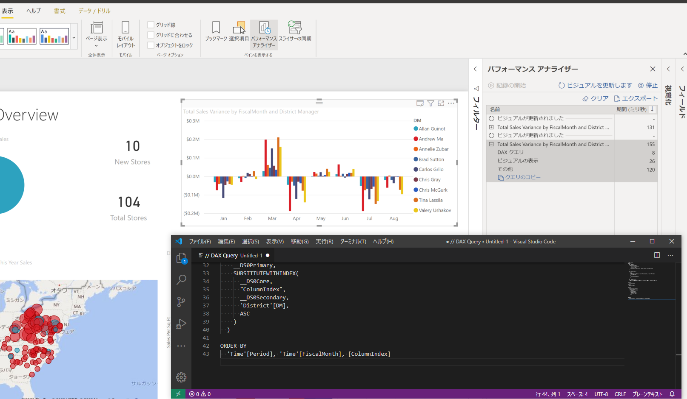
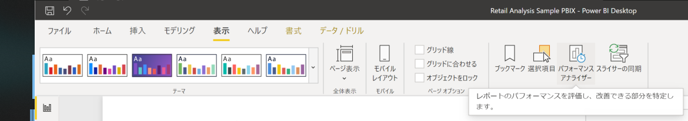
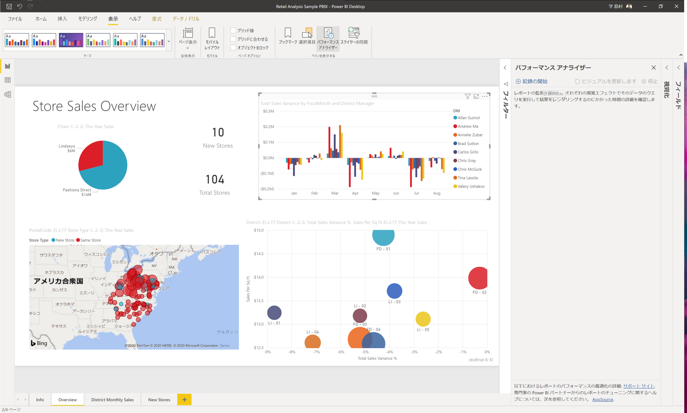
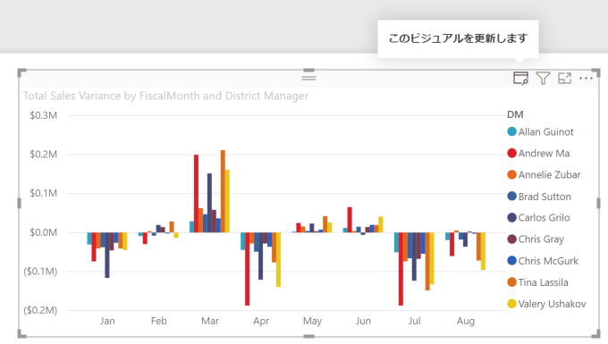
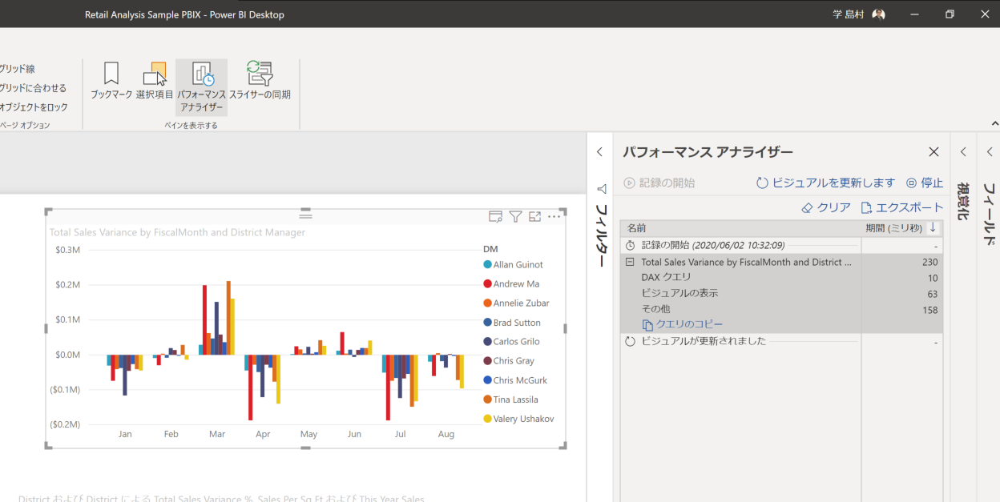
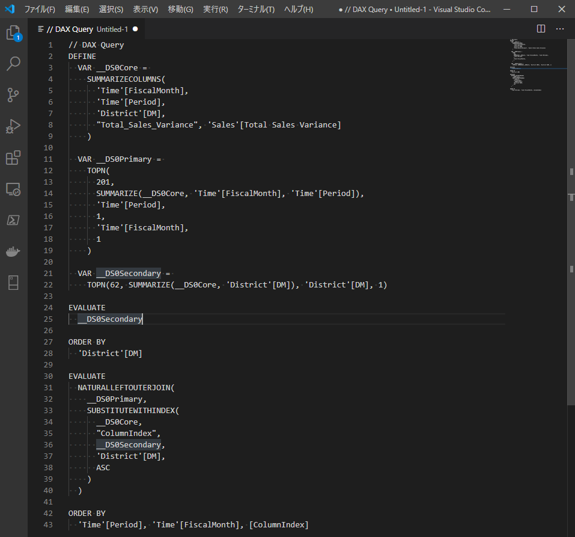

# Power BI パフォーマンスアナライザーでDAX Queryを作成する簡単な方法

<!-- TOC -->

- [Power BI パフォーマンスアナライザーでDAX Queryを作成する簡単な方法](#power-bi-パフォーマンスアナライザーでdax-queryを作成する簡単な方法)
  - [概要](#概要)
  - [手順](#手順)

<!-- /TOC -->

## 概要

DAX Queryを作成する簡単な手順として、Power BIのパフォーマンスアナライザーを利用した手順を紹介します。

Azure Analysis Service、SQL Server Analysis Servicesにライブ接続を実施した際にも、DAX Queryを作成することが可能です。テスト実施時にDAX Queryを作成しておき、DAX Studioから実行すると便利です。

## 手順

①Power BI Desktopにてレポートを開き、"表示"タブの”パフォーマンスアナライザー”を選択。

②"パフォーマンスアナライザー"ウィンドウにて、"記録の開始"を選択。

③ビジュアルを選択し、"このビジュアルを更新します"を選択。

④"パフォーマンスアナライザー"ウィンドウに表示されたビジュアル名のペインを開き、"クエリのコピー"を選択。

⑤ペーストを実施して、DAX Queryを確認。

