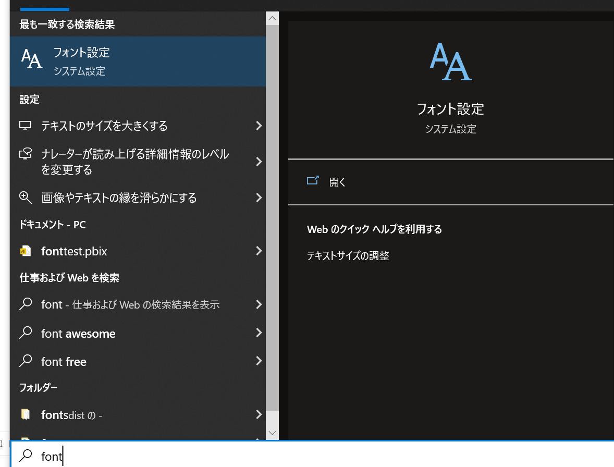
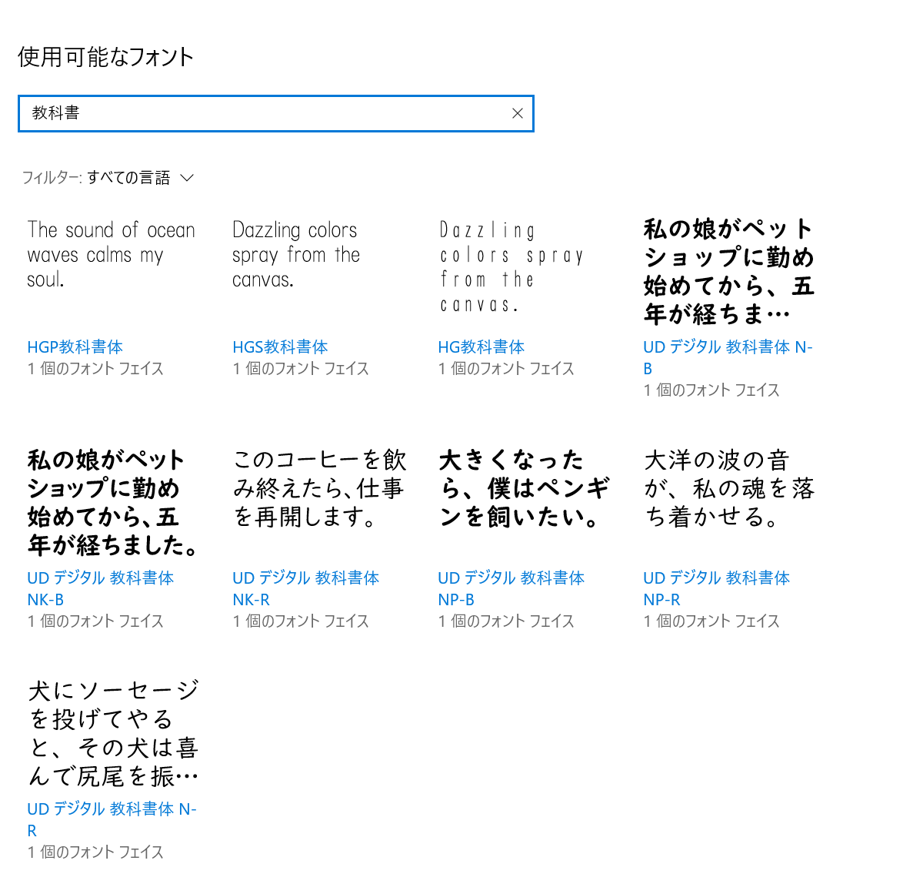
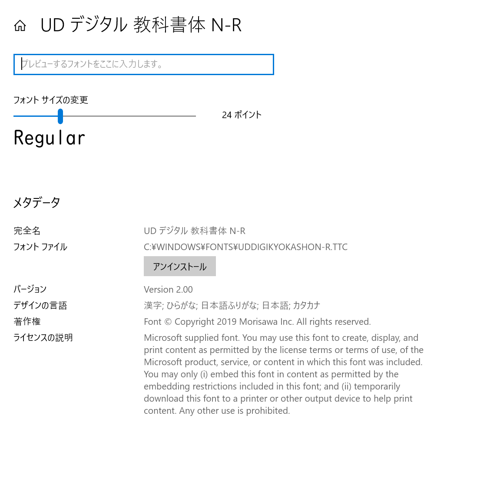
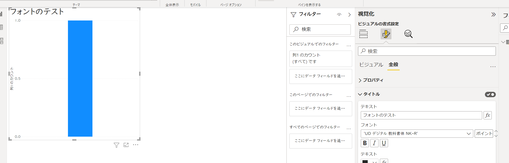

## はじめに

デフォルトだと日本語フォントがないので、カスタムテーマを使用して日本語フォントを設定する方法を紹介します。


## 手順

今回は記事「[教育現場で話題！子どもの学習意欲を上げる「ＵＤデジタル教科書体」とは？](https://diamond.jp/articles/-/236214)」でみた、「ＵＤデジタル教科書体」をPower BI に適用しようと思います。


## 参考

[Power BI Blog: Importing Fonts into Power BI](https://www.sumproduct.com/blog/article/power-bi-tips/power-bi-importing-fonts-into-power-bi)

[作業中使うことが多い Power BI レポート の カスタムテーマ](https://qiita.com/PowerBIxyz/items/e30751ff310f34e1d99c)

[Power BI Desktop でレポート テーマを使用する](https://docs.microsoft.com/ja-jp/power-bi/create-reports/desktop-report-themes)

[UD Digi Kyokasho font family](https://docs.microsoft.com/ja-jp/typography/font-list/ud-digi-kyokasho)

## 手順


### 1. フォントの確認
1. フォント設定を開きます。

2. 使用したいフォントを検索します。

3. 完全名をメモします。


※なにか別名で設定しないといけないのかと思いいくつか試しましたが、完全名でいけました。

### 2. カスタムテーマの作成

[レポート テーマをエクスポートする](https://docs.microsoft.com/ja-jp/power-bi/create-reports/desktop-report-themes#export-report-themes)に従って基となるテーマをjsonとして出力します。

サンプルは下記です。


```json:json

{
    "name": "Theme_font",
    "visualStyles": {
        "*": {
            "*": {
                "*": [
                    {
                        "fontSize": 12,
                        "fontFamily": "UD デジタル 教科書体 NK-R",
                        "color": {
                            "solid": {}
                        }
                    }
                ]
            }
        }
    }
}

```

### 3. カスタムテーマのインポート

[カスタムのレポート テーマ ファイルをインポートする](https://docs.microsoft.com/ja-jp/power-bi/create-reports/desktop-report-themes#import-custom-report-theme-files)に従ってテーマのjsonファイルをインポートします。

フォントが設定されます。




## 確認した制約事項

- Power BI Serviceに発行した場合、フォントはWeb上でも反映されますが、Power BI Service上で作成したレポートには反映されません。
  - カスタムテーマの制約という感じ