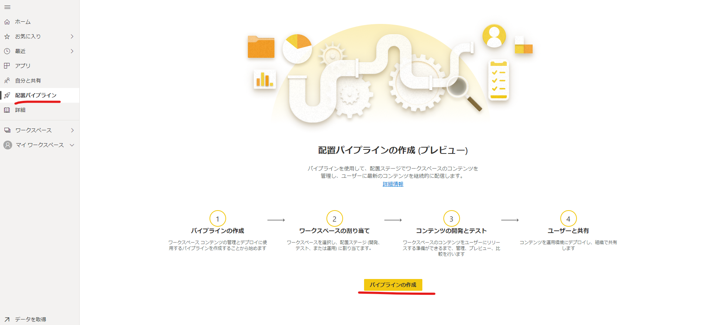
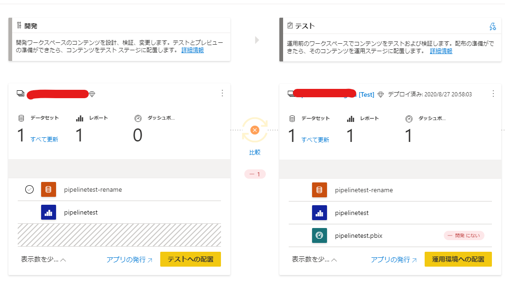

## はじめに

### 配置パイプラインとは

Power BIのコンテンツのうち、レポート、データセット、ダッシュボードを別のワークスペースに自動配置してくれる機能です。  
この機能により、開発環境→テスト環境→運用環境をといったステージ構成を簡単に準備し、リリース作業をスムーズに実施することが可能です。

[デプロイ パイプラインの概要](https://docs.microsoft.com/ja-jp/power-bi/create-reports/deployment-pipelines-overview)

## 利用手順

[デプロイ パイプラインの使用を開始する](https://docs.microsoft.com/ja-jp/power-bi/create-reports/deployment-pipelines-get-started)にしたがって実施していきます。

### 前提条件

>- Power BI の Pro ユーザーである 
>- Premium 容量を持つ組織に属している
>- 新しいワークスペース エクスペリエンスの管理者である

https://docs.microsoft.com/ja-jp/power-bi/create-reports/deployment-pipelines-get-started#accessing-deployment-pipelines

### 手順概要

1. 事前準備
1. デプロイ パイプラインの作成
1. デプロイ パイプラインへのワークスペースの割り当て
1. 空のステージにデプロイする
1. データセット ルールを作成する
1. 1 つのステージから別のステージへのコンテンツのデプロイ

### 1. 事前準備

３つのDB（開発、テスト、運用）を準備します。

今回は以下のようなsql serverを準備しました。

データベース内容は**AdventureWorksLT** を利用しています。

適当なレポートを作成して、Premium ライセンスを保有したテナントのPower BI ワークスペースに発行します。  
※開発環境のデータだとわかるように、pbi-pipeline-devの中のデータには**d-** とつけました。同様にテスト環境には**t-** とつけています。

### 2. デプロイ パイプラインの作成

では、デプロイパイプラインを構成してみます。

タブから「**配置パイプライン**」→「**パイプラインの作成**」の順にクリックします。

名前を設定します。

最初の段階ではパイプラインは環境が割り当てられていない状態です。

### 3. デプロイ パイプラインへのワークスペースの割り当て

次に、「**ワークスペースの割り当て**」をクリックすると、指定のワークスペースを環境に割り当てられます。

開発環境を割り当てました。

**割り当てられるワークスペースについて**

>- ワークスペースは、新しいワークスペース エクスペリエンスである必要があります。
>- このワークスペースの管理者である必要があります。
>- このワークスペースが、他のパイプラインに割り当てられていないことを確認します。
>- ワークスペースは、 premium 容量に存在する必要があります。
>- パイプライン ステージに Power BI サンプルを含むワークスペースを割り当てることはできません。

https://docs.microsoft.com/ja-jp/power-bi/create-reports/deployment-pipelines-get-started#workspace-assignment-limitations

### 4. 空のステージにデプロイする

「**テストへの配置**」をクリックすると、コピーが開始されます。

「テスト」、「実稼働」にコピーが完了すると、それぞれのコンテンツが確認できます。  
それぞれのステージは、最初に割り当てたワークスペースに[TEST]などが付与された名称で新しいワークスペースが作成されます。

### 5. データセット ルールを作成する

さて、DBはそれぞれの環境ごとに用意していました。  
環境ごとにデータセットが参照するDBを変更したいと思います。

デプロイの設定ボタンをクリックします。

参照先を変更したいデータセットを選択します。

「**規則の追加**」をクリックします。

DBの参照先を「**その他**」で置き換えます。  
内容は手入力可能です。  
ここでは、サーバ名を変更しました。ちなみに、パラメータの変更もこちらで可能です。

### 6. 1 つのステージから別のステージへのコンテンツのデプロイ

「**テストへの配置**」を実行するとルールを適用したうえで置き換えが開始されます。

資格情報が異なるので、テスト環境のデータセットに移動して、テスト環境のデータセットの資格情報を再セットしましょう。  
この時点で、デプロイのルールが適用されていることがわかります。

再設定後、テスト環境では、テスト環境用のDBが参照されるようになります。

運用環境でも同様の確認が可能です。

## 補足

### 名称変更について

コンテンツの名称を変えた場合も反映されるようです。

### 削除について

開発環境でコンテンツを削除した場合、他のステージへ削除の反映はされないようでした。

ただし、差分の検出することは可能です。※このパイプラインのUI上で削除することはできません。

