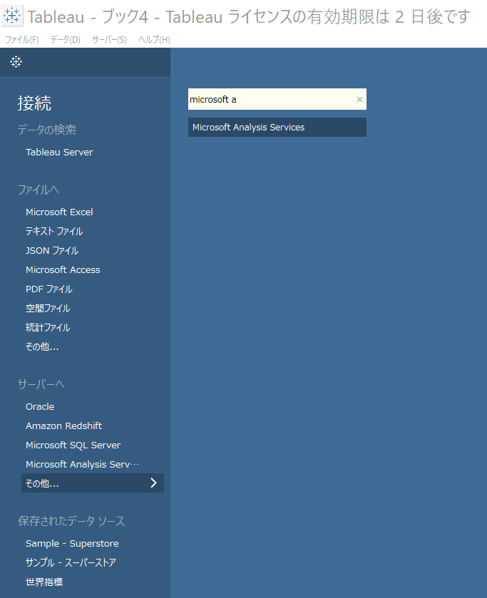
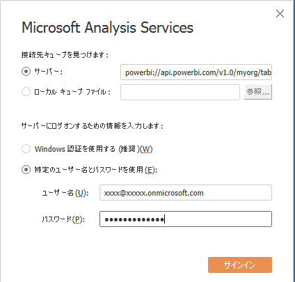
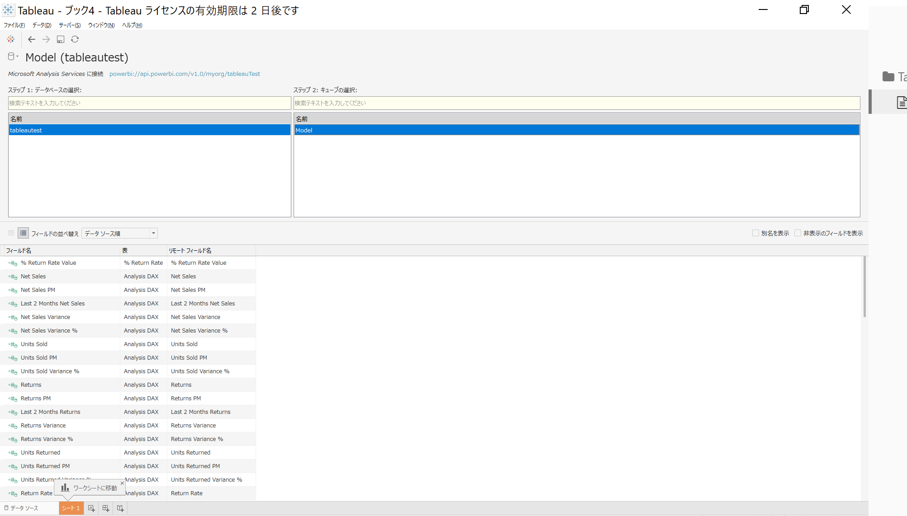
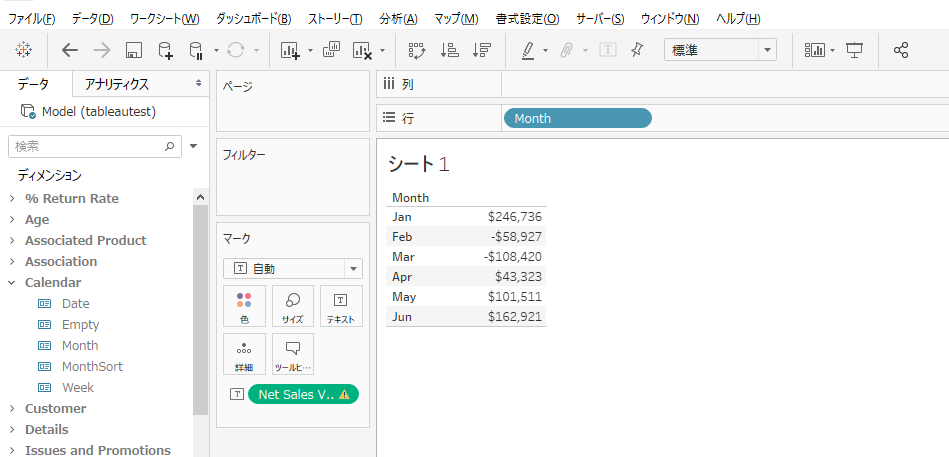
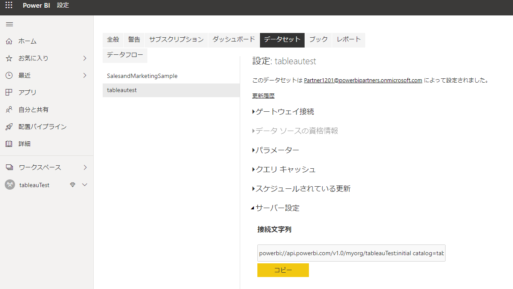
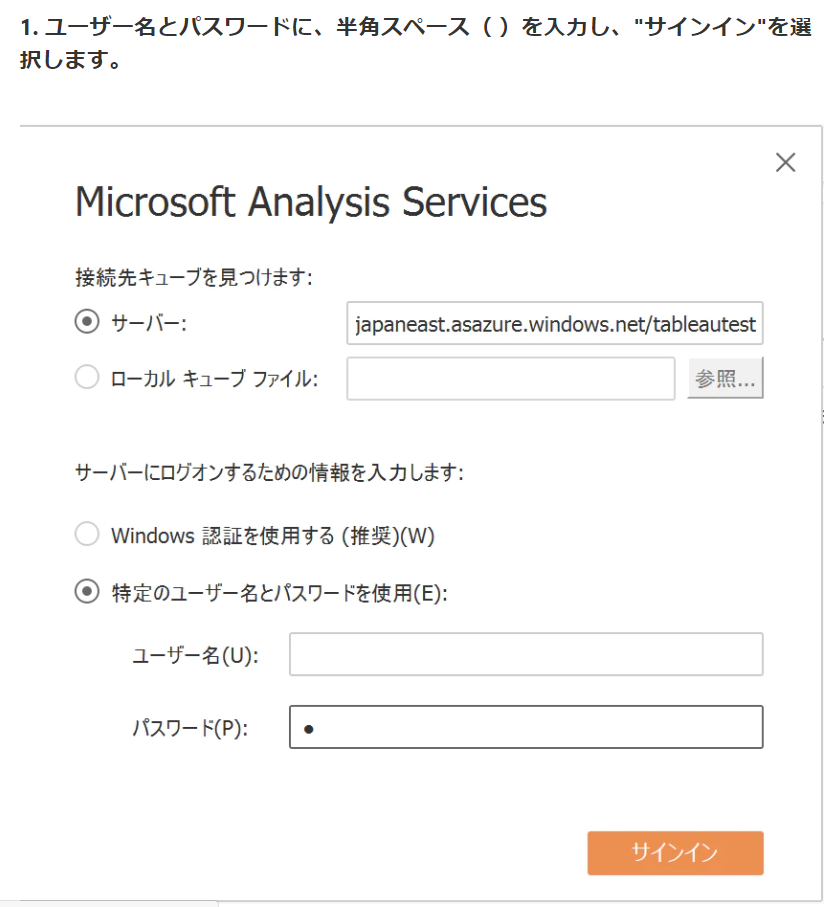

# Tableau DesktopからPower BI Premiumに接続する方法
<!-- TOC -->

- [Tableau DesktopからPower BI Premiumに接続する方法](#tableau-desktopからpower-bi-premiumに接続する方法)
  - [概要](#概要)
    - [補足](#補足)
  - [手順](#手順)
    - [①Tableau Desktopにて新規レポートを作成後、接続先として"Microsoft Analysis Services"を選択します。](#①tableau-desktopにて新規レポートを作成後接続先としてmicrosoft-analysis-servicesを選択します)
    - [②サーバーに上記URL、および、ユーザーアカウントを入力し、"サインイン"選択します。](#②サーバーに上記urlおよびユーザーアカウントを入力しサインイン選択します)
    - [③データベースの選択にてPowerBIのデータセットを選択し、キューブの選択にてパースペクティブ（基本的には、model）を選択します。](#③データベースの選択にてpowerbiのデータセットを選択しキューブの選択にてパースペクティブ基本的にはmodelを選択します)
    - [④可視化を実施できることを確認します。](#④可視化を実施できることを確認します)
  - [よくあるエラー](#よくあるエラー)
    - [問題1　Power BI Servicesのデータセットの接続文字列をコピーして貼り付けた場合](#問題1power-bi-servicesのデータセットの接続文字列をコピーして貼り付けた場合)
    - [問題2　MFAを設定したユーザーアカウントを利用する場合](#問題2mfaを設定したユーザーアカウントを利用する場合)

<!-- /TOC -->

## 概要

Tableau Desktopから、Power BI Premium(XMLAエンドポイント)に接続する方法を紹介します。

Tableau　Desktopから、Microsoft Analysis Servicesに対して、下記URLとアカウント情報により接続可能です。


接続URL

```
powerbi://api.powerbi.com/v1.0/{myorg or ドメイン名}/{ワークスペース名}
```

| 番号 | 名称                | 説明                                                         |
| ---- | ------------------- | ------------------------------------------------------------ |
| 1    | myorg or ドメイン名 | 自テナントのPower BI  Serviceに接続する場合は、myorgを指定してください。他テナントの場合は、ドメイン名（XXX.onmicosoft.com　など）を指定してください。 |
| 2    | ワークスペース名    | Power BI Servicesにおけるワークスペース名を指定してください。 |


サンプル（自テナントのtableauTestというワークスペースに接続する場合）

```
powerbi://api.powerbi.com/v1.0/myorg/tableauTest
```

### 補足
Power BI の接続URL（XMLAエンドポイント）について

参考リンク
[ワークスペースの接続 URL を取得するには](https://docs.microsoft.com/ja-jp/power-bi/admin/service-premium-connect-tools#to-get-the-workspace-connection-url)

## 手順

### ①Tableau Desktopにて新規レポートを作成後、接続先として"Microsoft Analysis Services"を選択します。




### ②サーバーに上記URL、および、ユーザーアカウントを入力し、"サインイン"選択します。




### ③データベースの選択にてPowerBIのデータセットを選択し、キューブの選択にてパースペクティブ（基本的には、model）を選択します。




### ④可視化を実施できることを確認します。




## よくあるエラー

### 問題1　Power BI Servicesのデータセットの接続文字列をコピーして貼り付けた場合

Power BI Service上で取得したURLには、データセット（catalog）が指定されているためTableau Desktop ではエラーとなります。

コピーしたURLからinitial　catalog部分（;initial catalog=tableautest）を削除してください。




下記のようなエラーがでます。

>   powerbi://api.powerbi.com/v1.0/powerbipartners.onmicrosoft.com/tableauTest;initial catalog=tableautest' との通信中にエラーが発生しました
>    サーバーに接続できません。サーバーが実行中であり、要求したデータベースへのアクセス権を持っていることを確認してください。
>    エラー コード: A7AED4D2
>    データベース エラー 0x80004005: 次のシステム エラーが発生しました:  指定されたクラスが見つかりません。
>    サーバーに接続できません。サーバーが実行中であり、要求したデータベースへのアクセス権を持っていることを確認してください。


### 問題2　MFAを設定したユーザーアカウントを利用する場合

ユーザーとパスワードに半角スペース” ”を入力してください。詳細は下記Qiita投稿記事にて紹介されております。



引用元：[Tableau DesktopからAzure Analysis ServicesにMFAが設定されているユーザーでログインする方法](https://qiita.com/manabian/items/82450a37b0a1987f0738)


