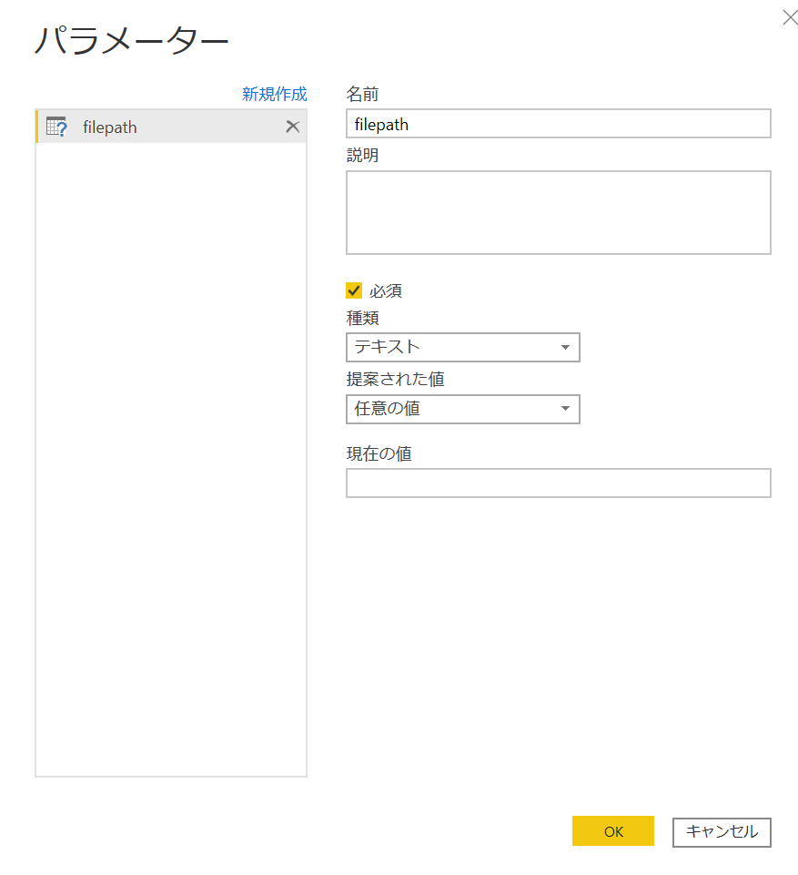

# PowerBIの.pbix,.pbit,.pbidsについて

<!-- TOC -->

- [PowerBIの.pbix,.pbit,.pbidsについて](#powerbiのpbixpbitpbidsについて)
    - [はじめに](#はじめに)
        - [参考記事](#参考記事)
    - [それぞれの違い](#それぞれの違い)
    - [pbix](#pbix)
    - [pbit](#pbit)
        - [作成方法](#作成方法)
            - [データの入手](#データの入手)
            - [レポート作成](#レポート作成)
            - [利用方法](#利用方法)
            - [テンプレートファイルはこちら](#テンプレートファイルはこちら)
    - [pbids](#pbids)
        - [作成方法](#作成方法-1)
        - [利用方法](#利用方法-1)

<!-- /TOC -->


## はじめに

PowerBIはpbix以外の拡張子でも利用できる機能があることをご紹介します。

### 参考記事


https://docs.microsoft.com/ja-jp/power-bi/connect-data/desktop-data-sources#using-pbids-files-to-get-data

https://powerbi.tips/2019/10/make-pbids-files/


本記事についてはgithubにもソースを載せておきました。

[テンプレート、データソースファイルについて](https://github.com/ryoma-nagata/MyQiitaDocs/tree/master/PowerBI/%E3%83%86%E3%83%B3%E3%83%97%E3%83%AC%E3%83%BC%E3%83%88%E3%80%81%E3%83%87%E3%83%BC%E3%82%BF%E3%82%BD%E3%83%BC%E3%82%B9%E3%83%95%E3%82%A1%E3%82%A4%E3%83%AB%E3%81%AB%E3%81%A4%E3%81%84%E3%81%A6)

## それぞれの違い

| # | 対象  |説明  |
|---------|---------|---------|
|1|pbix|基本の拡張子です。レポート、接続情報、(importの場合、データ+モデル。Direct Queryの場合モデルのみ)が含まれます         |
|2|pbit|テンプレートファイルの拡張子です。レポートとモデルが含まれます。データは含まれません|
|3|pbids|接続情報のみが含まれます|

## pbix

[Power BI のチュートリアル](https://docs.microsoft.com/ja-jp/power-bi/create-reports/sample-datasets)をご参照ください。

## pbit

参考記事
[Power BI Desktop のレポート テンプレートを作成する](https://docs.microsoft.com/ja-jp/power-bi/create-reports/desktop-templates)

### 作成方法

1. データの入手
2. レポート作成
3. テンプレートをエクスポート

#### データの入手

財務サンプルのExcelファイルを[ダウンロード](https://docs.microsoft.com/ja-jp/power-bi/create-reports/sample-financial-download)します。

#### レポート作成

Power BI を起動して、Excelデータを取得します。


対象ファイルを開いて、「financials」データを読み込みます。


適当なレポートを作成します。


このままテンプレートを作成することも可能ですが、工夫をしてみます。Excelファイルパスをパラメータ化してみます。

まずはPower Query エディターを開きます。


現在のファイルパスをメモしておきます。


パラメータを作成します。


適当な名前を入力して、種類をテキストにしておきます。



先ほどメモするために開いた、データソースのパスをパラメータの名称に変更します。完了したら閉じて適用を選択します。


ではpbitファイルをエクスポートしてみましょう。

ファイルタブを開きます。


エクスポートします。


#### 利用方法

先ほど作成したFinancialSample.pbit（という名前で作成しました。）を開いてみると、パラメータの内容を求められます。
Excelのデータをおいているパスを入力することで、指定されたファイルからレポートテンプレートにデータが読み込まれます。


#### テンプレートファイルはこちら

[Gitlink](https://github.com/ryoma-nagata/MyQiitaDocs/tree/master/PowerBI/%E3%83%86%E3%83%B3%E3%83%97%E3%83%AC%E3%83%BC%E3%83%88%E3%80%81%E3%83%87%E3%83%BC%E3%82%BF%E3%82%BD%E3%83%BC%E3%82%B9%E3%83%95%E3%82%A1%E3%82%A4%E3%83%AB%E3%81%AB%E3%81%A4%E3%81%84%E3%81%A6/source)


## pbids

参考記事
[PBIDS ファイルを使用したデータの取得](https://docs.microsoft.com/ja-jp/power-bi/connect-data/desktop-data-sources#using-pbids-files-to-get-data)

[PowerBIブログ](https://powerbi.microsoft.com/en-us/blog/power-bi-desktop-october-2019-feature-summary/#pbids)

[解説記事](https://powerbi.tips/2019/10/make-pbids-files/)

記事の中ではpbidsファイルを自動作成するサイトが照会されています。


### 作成方法

データソースの種類ごとにjsonで.pbidsファイルを作成するだけです。
適当なエディタにはりつけて、<ファイル名>.pbidsで保存してください。
フォルダの/はエスケープしてあげてください。

```json
{
   "connections":[
      {
         "details":{
            "protocol":"file",
            "address":{
               "path":"C://フォルダパス～"
            }
         }
      }
   ],
   "version":"0.1"
}
```

参考


### 利用方法

pbidsファイルが作成され、アイコンも変わります。
開くと、ファイルの内容が開かれます。


