## はじめに

Power BIは他の組織（Azure ADテナント）のユーザーとコラボレーションするためにAzure AD B2Bの利用に対応しています。
これを利用することで、パートナー企業などの他組織のユーザーにレポートを公開したり、編集権限を与えるなどのシナリオが達成できます。

ただし、Power BI Desktopからレポートを発行するよくある操作の流れでは、他組織のユーザーは招待された組織のPower BI ワークスペースにPower BI Desktopから直接外部組織上のPower BI Service接続することができず、Power BI Service上で、pbixをアップロードするなど作業が必要でした。

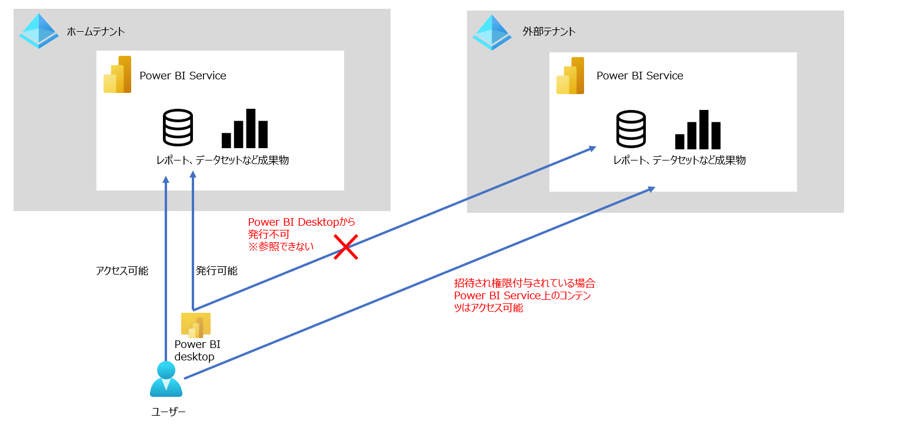

[Publish from Power BI Desktop for External Users](https://www.youtube.com/watch?v=x1xMxRXQ2So)　にて、**ゲスト招待された外部テナント上のPower BI ServiceにPower BI 成果物を発行する** が案内されていたため、紹介します。

## 対応方法概要

Azure ADのサインインオプションでどこの組織（テナント）にログインするかを選べるようになったため、Power BI Desktopでサインインする組織を選択することで実現可能です。（いつからかサインインオプションつきましたね。）

## 手順

### 前提条件

最低2点のPower BI 全体設定の構成が必要です。

1.  [Azure Active Directory のゲスト ユーザーによる Power BI へのアクセスを許可する](https://docs.microsoft.com/ja-jp/power-bi/admin/service-admin-portal-export-sharing)

Azure AD B2B で招待されたユーザーがPower BI にアクセスできる必要があります。

2. [外部のゲスト ユーザーによる組織内のコンテンツの編集および管理を許可する](https://docs.microsoft.com/ja-jp/power-bi/admin/service-admin-portal-export-sharing#allow-external-guest-users-to-edit-and-manage-content-in-the-organization)

招待されたユーザーに編集権限を与える許可設定が必要です。

その他、そもそもAzure AD B2Bにて外部テナントのユーザーが招待されている（あるいはPower BI で招待するように許可する）必要があったりしますが、上記記事にて確認可能です。

#### 参考

[ホワイトペーパー：Azure Active Directory B2B を使用して外部ゲスト ユーザーに Power BI コンテンツを配布する](https://docs.microsoft.com/ja-jp/power-bi/guidance/whitepaper-azure-b2b-power-bi)

[Azure AD B2B で外部ゲスト ユーザーに Power BI コンテンツを配布する](https://docs.microsoft.com/ja-jp/power-bi/enterprise/service-admin-azure-ad-b2b)

### 1. Power BI テナント設定の確認

管理ポータルに移動します。

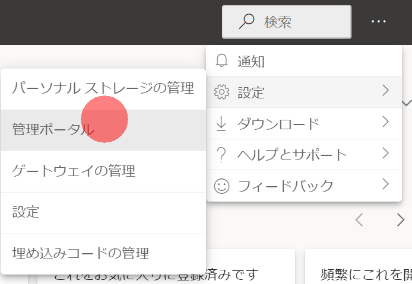

**エクスポートと共有の設定** 上で、前提条件となっている設定が有効になっているか確認します。無効の場合は、有効化します。可能なら特定のセキュリティグループのみとしたほうがよいです。

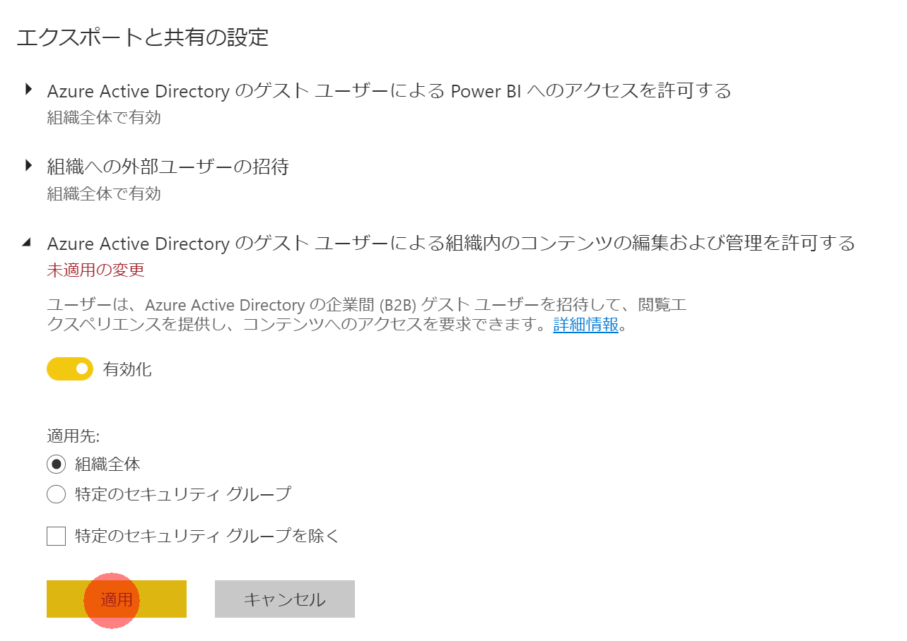

### 2. Power BI Workspace上で外部ユーザーに権限付与する

通常の権限付与の流れでPower BI Workspaceにユーザーを追加します。
外部ユーザーはUPNがユーザー名_<ホームテナント名>#EXT#@<招待されたテナント名>となります。

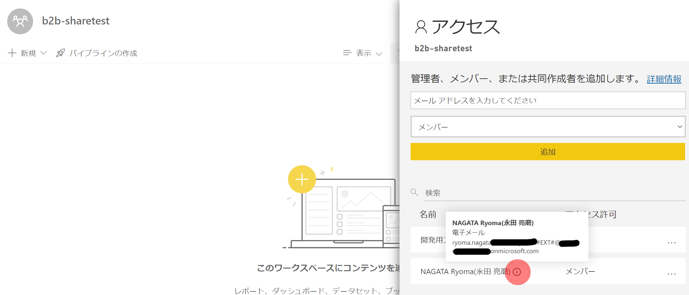

### 3. 外部ユーザーが発行する

適当なレポートをPower BI Desktopで作成し、 **サインイン** します。画像のようにサインイン済みであれば一度サインアウトしましょう。

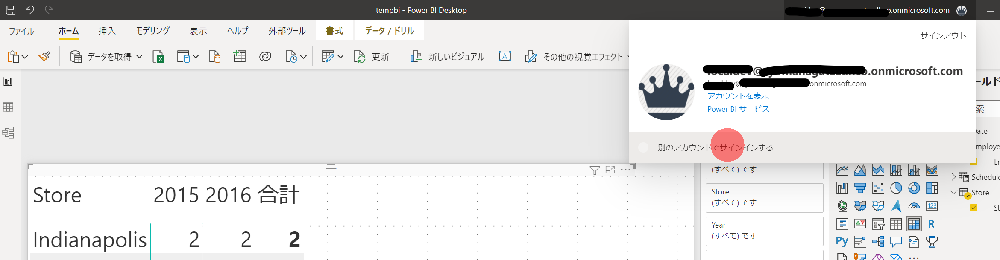

メールアドレスを入力してサインインします。

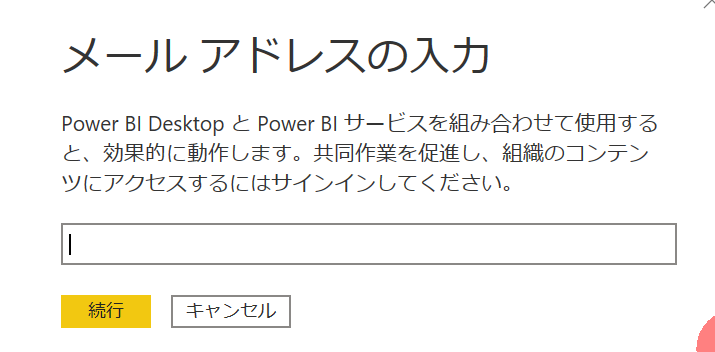

**別のアカウント** を選択

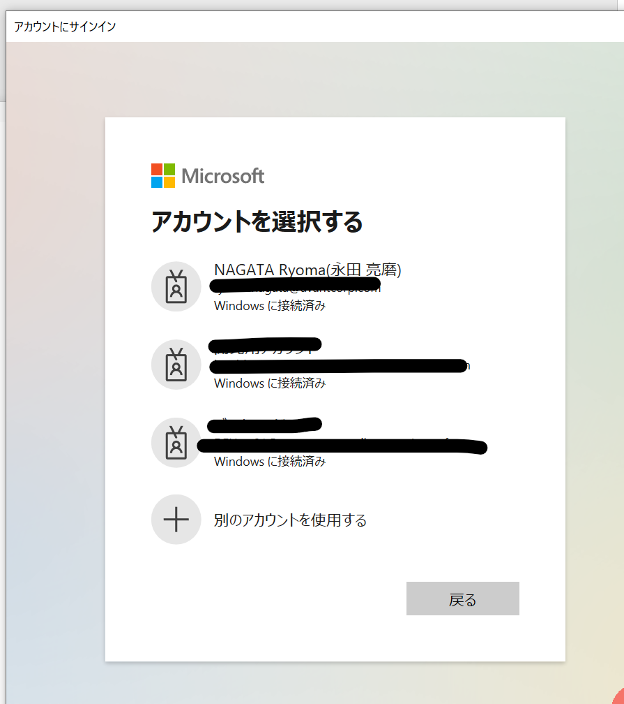

**サインインオプション** を選択

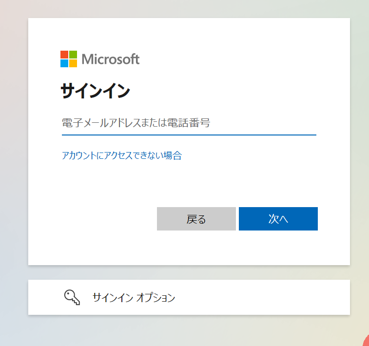

**組織へのサインイン** を選択

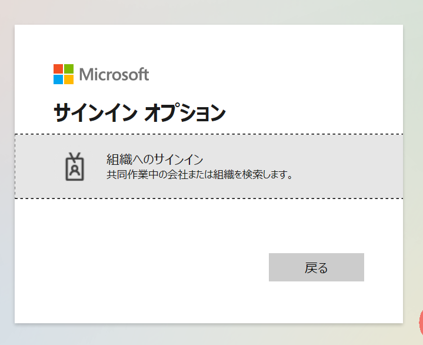

招待された組織のドメイン名を入力し、あらためてサインインを進めます。

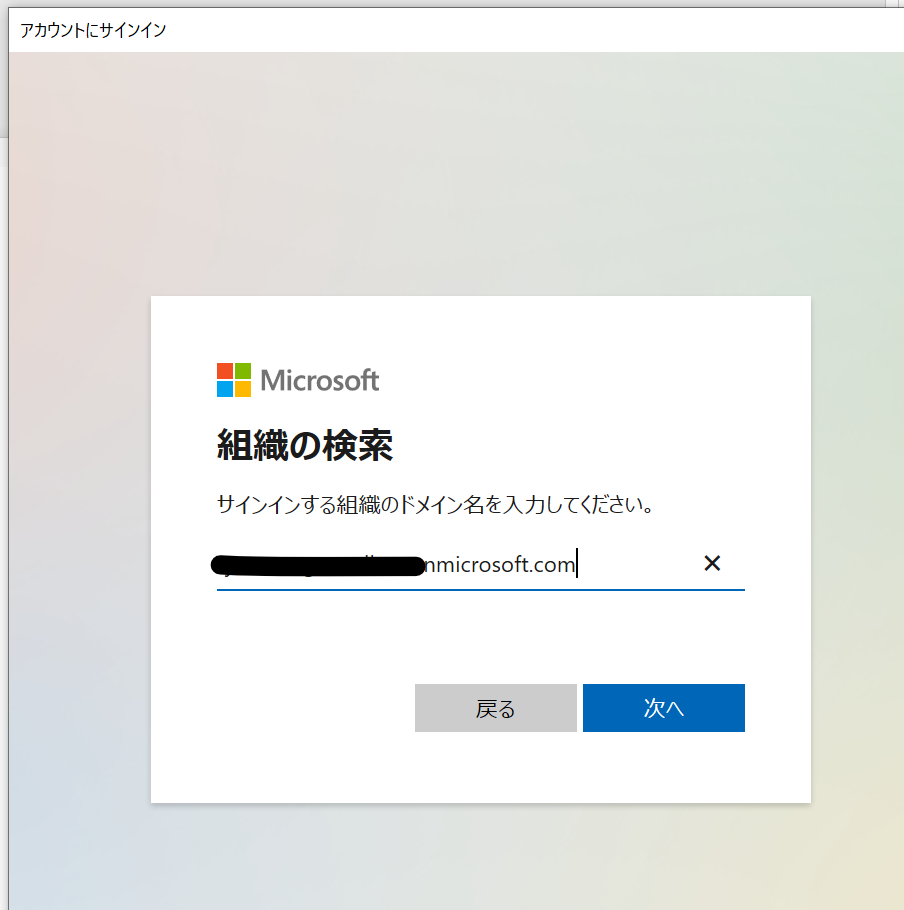

この状態で **発行** を選択すると、

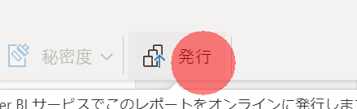

招待された組織上のPower BI Workspaceが表示されます。

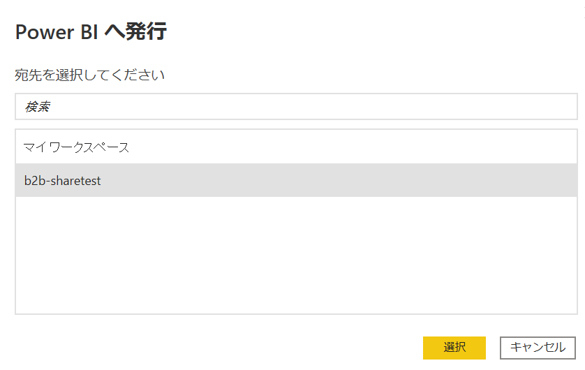

発行ができました。

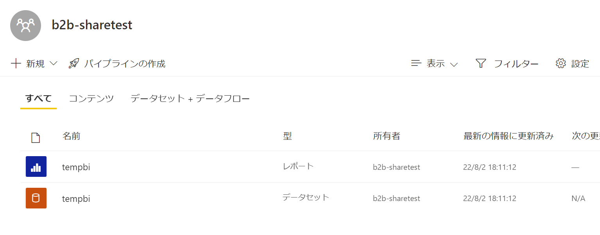

## 注意事項

youtubeでも触れられていますが、機密度ラベルの設定は適用されないことには注意してください。

また、Power BI Dataflowでの自動機械学習など、別のデータフローを自動的に参照してしまうような機能では、今回のような他組織へのサインインが実行されず、Not foundなエラーを起こしてしまう点も注意となります。

