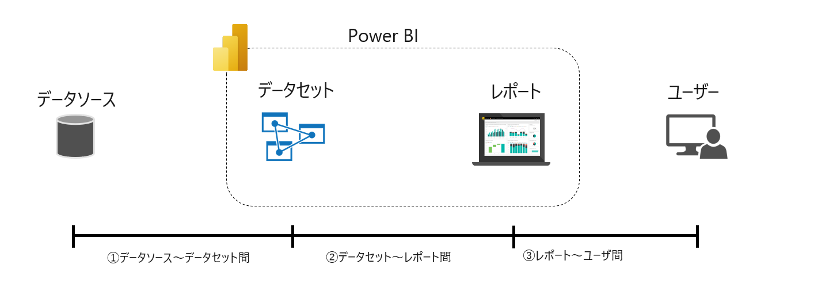
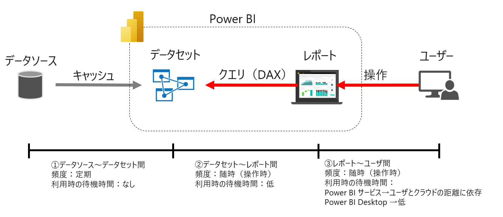
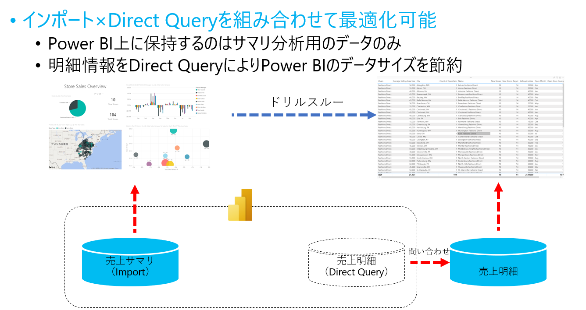

# 改めてPower BI データセットのストレージモードについて整理する

- [改めてPower BI データセットのストレージモードについて整理する](#改めてpower-bi-データセットのストレージモードについて整理する)
  - [はじめに](#はじめに)
    - [前提知識と用語の整理](#前提知識と用語の整理)
      - [モデルとデータセット](#モデルとデータセット)
      - [Power BI データセットの種類](#power-bi-データセットの種類)
      - [Power BI Desktopで発行するデータセットの構成要素](#power-bi-desktopで発行するデータセットの構成要素)
    - [この記事のスコープ](#この記事のスコープ)
  - [ストレージモードの種類](#ストレージモードの種類)
    - [種類](#種類)
    - [Live接続モードの補足](#live接続モードの補足)
  - [ストレージモードのそれぞれの特性](#ストレージモードのそれぞれの特性)
    - [待機時間とデータの保持場所](#待機時間とデータの保持場所)
      - [Import モード](#import-モード)
      - [Direct Query モード](#direct-query-モード)
      - [Dual Mode モード](#dual-mode-モード)
    - [データの鮮度](#データの鮮度)
      - [Import & Dual モード](#import--dual-モード)
      - [Direct Query](#direct-query)
    - [制約、注意事項](#制約注意事項)
      - [Import モード](#import-モード-1)
        - [Analysis Services or Power BI Premium?](#analysis-services-or-power-bi-premium)
        - [新しいPower BI Preimium Gen2でのサイズ制限について](#新しいpower-bi-preimium-gen2でのサイズ制限について)
      - [Direct Query](#direct-query-1)
      - [Dual モード](#dual-モード)
  - [使い分け](#使い分け)
    - [補足](#補足)
    - [使い分けの戦略](#使い分けの戦略)
      - [リアルタイム性が重視される場合](#リアルタイム性が重視される場合)
      - [リアルタイム性が重視されない場合](#リアルタイム性が重視されない場合)
        - [1. Import で収まるデータサイズならImportを利用する。](#1-import-で収まるデータサイズならimportを利用する)
        - [2. 大規模な明細データにDirect Queryを利用する。](#2-大規模な明細データにdirect-queryを利用する)
    - [複合モデルでの使い分け例](#複合モデルでの使い分け例)
      - [一般的な例](#一般的な例)
      - [データセット自体の複合化例](#データセット自体の複合化例)
  - [その他参考リンク](#その他参考リンク)

## はじめに

Power BIのストレージモードについて、ドキュメントやMS Learnなど見ているとある程度わかっている方も多いかと思いますが、やっぱり複雑なので整理します。
特性を抑えて、適切な開発に役立てていただければ幸いです。

(2020/12月時点の情報です)

### 前提知識と用語の整理

#### モデルとデータセット

Power BI で作成・管理される、データモデルを指します。
Power BI の可視化レポートは全て、データセットに定義された列情報やメジャーから作成されます。

Power BIのドキュメントでは、しばしば"モデル"や、"データセット"を同じものとして扱うため、以下のようにこの二つの用語を使い分けることとします。

- **Power BI データセット**：Power BI の管理オブジェクト
- **データモデル**：データとデータの関係や、メタ情報が定義されたもの

>このドキュメントでは、"データセット" と "モデル" という用語が同じ意味で使用される場合があります。 これは一般に、Power BI サービスの観点からは データセット と呼ばれ、開発の観点からは モデル と呼ばれています。 このドキュメントのコンテキストでは、それらはほぼ同じ意味です。

引用：[データセットの種類 注意](https://docs.microsoft.com/ja-jp/power-bi/connect-data/service-datasets-understand#dataset-types)

#### Power BI データセットの種類

3種類に分けられます。

- **Power BI Desktopで発行するデータセット**
- **Excel ブックをアップロードしたデータセット**
- **リアルタイムデータセット**

一般に、Power BI でデータセットというとPower BI Desktopで発行されるデータセットを指すことがほとんどです。

#### Power BI Desktopで発行するデータセットの構成要素

Power BI Desktopで発行するデータセットは、主に以下を定義して構成されます。

- **データソース**：データ取得元となる接続先情報
- **ストレージモード**：データの保持形式
- **Power Query**：所得したデータをテーブルに変換する際の前処理
- **データモデル**：テーブル間のリレーションシップ、KPI、メジャー、ロール、データセットを利用するユーザに表示するメタ定義

また、Power BIで開発されるデータセットは、SQL Server Analysis Services、ならびに、Azure Analysis Servicesで定義されるDBと同一の技術、構成要素が使用されており、Power BI のレポートはPower BI データセット、SQL Server Analysis Services、ならびにAzure Analysis Servicesのどれからも作成することができます。

### この記事のスコープ

前置きが長くなりましたが、本記事では**Power BI Desktopで発行するデータセット**を対象として、特に重要な要素である、**ストレージモード**の内容と使い分けを解説します。

## ストレージモードの種類

### 種類

Power BI データセットを開発するうえで、性能や、データ表現、管理運用の設計に大きく寄与するのがストレージモードです。

3種類（+1つの特別な呼称）あります。  
これらを組み合わせたデータセットを作成することも可能です（**複合モード**）

- **Import モード**
- **Direct Query モード**
- **Dual モード**

Direct Query の中でも、Power データセット、SQL Server Analysis Services、ならびに、Azure Analysis Servicesや、SAP HANAなどの多次元データソースなどをデータソースとした場合のみ**Live接続モード**と呼ばれています。
Live 接続モードではデータセット内の定義を変更することができず、既存のデータセットをそのまま使うことになります。

### Live接続モードの補足

プレビュー機能である、 **Power BIデータセットおよびAnalysis Services用のDirect Query** が登場したことにより、Live接続で見受けられた制限である、「データセットをそのまま使う」が、緩和されて、既存のデータセット自体は変更できないものの、データセットを追加のソースとして扱って、新しいテーブルを組み合わせるなどをした結果のデータセットを定義することができるようになってきています。
そのため、Live接続という呼称は消えるものと考えられます。

※Docs内でもLive接続に関する記載が修正されつつあるように見受けられます。

[Power BI Blog](https://powerbi.microsoft.com/en-us/blog/directquery-for-power-bi-datasets-and-azure-analysis-services-preview/)

[【Power BI機能速報】Power BIデータセットおよびAnalysis Services用のDirect Query がプレビュー](https://qiita.com/ryoma-nagata/items/265a10c214f1bd170d4d)

## ストレージモードのそれぞれの特性

### 待機時間とデータの保持場所

BIツールでは性能要件に「x秒以内でのデータ表示」などが要求されることが多いですが、これを達成するうえで、データがどこに保持されているかが重要となります。

一般に、レポートに利用されるデータがクライアントに近いほど反応よくレポートを操作することができます。

また、コンプライアンスの観点からもデータが実際に保持される場所は考慮事項の一つとなります。

待機時間の発生箇所を整理すると、以下のようなイメージとなります。
この三つの待機時間をできるだけ短くすることが、性能を確保するポイントになります。

ストレージモードは①、②の待機時間に影響を与えます。

#### Import モード

**待機時間が最短**になるのがImport モードです。**データの保持場所はデータセット内**となります。

イメージ

スケジュール更新により事前にデータセット内にデータをキャッシュすることで、ユーザの利用時での①の待機時間は0といえます。

他社BIツールでもBIサーバとして、レポートを接続する先のサーバにデータを保持させておくことは珍しくないと思います。

Power BI では、VertiPaqストレージエンジンと呼ばれるエンジンがデータを列指向型のフォーマットに変換し、インメモリに展開することで、高速なクエリを可能にします。

[VertiPaq — “Brain & Muscles” behind Power BI](https://towardsdatascience.com/vertipaq-brain-muscles-behind-power-bi-eecd6c8891e3)

#### Direct Query モード

**待機時間に注意が必要**なのが、Direct Query モードです。ただし、**データセット内にはデータを保持しない**ため、クラウド上でのデータ保持禁止の要件への対応が可能です。

イメージ

ユーザが操作するたびに、データセットからデータセットにクエリが発行されるため、①の待機時間が随時発生し、その時間はデータソースの性能と距離に依存します。

また、相手先がデータセット（Analysis Serivecesを含む）場合には、SQLは発行されずに直接DAXが発行されますが、距離は注意ポイントになります。

1. Power BIデータセットの場合：短
2. Analysis Services
   1. Azure : 中～　Power BI テナントとAnalysis Servicesのデプロイリージョン間の距離に依存。
   2. オンプレミス:長～ オンプレミスNWとの通信速度に依存

イメージ

更に、相手先のデータセットがDirect Query モードの場合、追加の待機時間の発生の考慮が必要です。

#### Dual Mode モード

データをインポート後、必要に応じてSQLクエリが発行されるハイブリッドな形式です。 

イメージ

待機時間に関しての考慮事項としては、結合の組み合わせで変わります。

カレンダーマスタ（Dual）×　売上集計ファクト（Import）のような場合には、全てのクエリはキャッシュから返されるため、短時間です。

カレンダーマスタ（Dual）×　売上明細ファクト（Direct Query）がある場合には、DualのテーブルはDirect Query で処理されるので待機時間が発生します。

このとき、カレンダーマスタのデータについてキャッシュを利用しないのは、集計についてはDirect Query の結果をキャッシュと結合して集計するよりも、はじめから結合を含む集計クエリを送信したほうが高速なためです。
この選択はPower BI で決定されます。

このあたりのパフォーマンスtipsについては参考リンクをご覧ください。

[キャッシュにヒットするクエリまたはヒットしないクエリ](https://docs.microsoft.com/ja-jp/power-bi/transform-model/desktop-storage-mode#queries-that-hit-or-miss-the-cache)

[Understanding Power BI Dual Storage](https://prologika.com/understanding-power-bi-dual-storage/)

### データの鮮度

#### Import & Dual モード

データの更新タイミングにもとづくため、最新でないデータが参照される場合があります。

#### Direct Query 

常にデータソースを参照するため、最新のデータです。

### 制約、注意事項

各ストレージモードには無視できない制約や、注意事項があります。

#### Import モード

最大データサイズに制限があります。

Power BI Pro or Freeで利用可能な環境は共有環境が基本となり、1GBのデータセットが上限となります。
最大1/10の圧縮が可能とされているフォーマットであるため、小中規模なデータであれば案外収まります。

大きなデータをキャッシュしたい場合にはPower BI PremiumもしくはAzure Analysis Servicesでは最大400GBのデータセットがサポートされます。

[インポート モデリングのデータ削減手法](https://docs.microsoft.com/ja-jp/power-bi/guidance/import-modeling-data-reduction#disable-power-query-query-load)

[Announcing large model support in Power BI Premium General Availability (GA)](https://powerbi.microsoft.com/en-us/blog/announcing-large-model-support-in-power-bi-premium-general-availability-ga/)

[Power BI Premium での大規模なデータセット](https://docs.microsoft.com/ja-jp/power-bi/admin/service-premium-large-models)

また、**一度ImportにしたテーブルはDirectQueryに変更ができません。**

##### Analysis Services or Power BI Premium?

大規模なデータセットがサポートされるまでは13GBがPower BI Premiumの最大のため、それ以上のデータセットをImportで扱いたい場合にはAzure Analysis Servicesを利用するのが基本でした。

現在では、400GBが最大となっているため、サイズ観点では同等となります。

したがって、両者の使い分けは現在、コスト効果がポイントとなります。
Power BI Premiumは専用容量に加え、無制限の共有などの各種SaaS機能が付随するライセンスのため、Azure Analysis Servicesに比べて高額です。

[Power BI 価格](https://powerbi.microsoft.com/ja-jp/pricing/)

[Azure Analysis Services の価格](https://azure.microsoft.com/ja-jp/pricing/details/analysis-services/)

##### 新しいPower BI Preimium Gen2でのサイズ制限について

現在のところ、以下のような規定となり、従来400GB内をやりくりする必要があったメモリが実質無制限となるように見受けられます。※ただし、単一のデータセットの制限は25GBとなる。

>Premium Gen2 では、各ノード サイズで使用できるメモリ量は、メモリの累積消費量ではなく、1 つのアーティファクトのメモリ占有領域の制限に設定されます。 たとえば、Premium Gen2 では、1 つのデータセットのみのサイズが 25 GB に制限されています。一方、元の Premium では、同時に処理されるデータセットの合計メモリ占有領域が 25 GB に制限されていました。

引用：[Premium Gen2 (プレビュー) の更新](https://docs.microsoft.com/ja-jp/power-bi/admin/service-premium-what-is#updates-for-premium-gen2-preview)

#### Direct Query

Importに見られるサイズの制限はありませんが、いくつかの注意点があります。

1. 変換や、モデリングの機能制限
詳しくは下記参考リンク

2. 取得できる行数は100万行
   
クエリをDBにプッシュダウンできるため、1000万行のテーブルの集計値を得ることはできますが、集計結果が100万行を越える場合、エラーとなってしまいます。

3. データソースへの負荷

常にDBにクエリを発行することになるため、DBに負荷が大きくかかります。

[DirectQuery を使用する影響](https://docs.microsoft.com/ja-jp/power-bi/connect-data/desktop-directquery-about#implications-of-using-directquery)

[DirectQuery の制限](https://docs.microsoft.com/ja-jp/power-bi/connect-data/desktop-use-directquery#important-considerations-when-using-directquery)

#### Dual モード

データサイズの制限はImport同様、機能面ではDirect Query と同様の機能制限を受けます。

## 使い分け

複合モードを利用して、データセットの単位ではなく、テーブルの単位でストレージモードの使い分けを検討します。

### 補足

Import と Direct Queryのテーブルは直接1対多の結合をすることができず、以下のようなルールになります。

|多  |1  |
|---------|---------|
|Import     |　Import もしくはDual         |
|Dual     | Dual     |
|Direct Query     | Direct Query もしくはDual        |

### 使い分けの戦略

第一にリアルタイム性で判断します。
スケジュール更新（最大8回/日@Pro、48回/日@Premium、無制限/日@Analysis Services  ）が許容される場合にはいくつか検討ポイントが生まれます。

#### リアルタイム性が重視される場合

常にデータソースの最新状態が必要な場合にはDirect Queryで作成されたデータセットを利用します。

#### リアルタイム性が重視されない場合

##### 1. Import で収まるデータサイズならImportを利用する。

データサイズの制限を考慮の上、可能な限りImportモードでの開発が推奨されます。
レスポンスがよく、モデリングなどの機能制限がないためです。

##### 2. 大規模な明細データにDirect Queryを利用する。

集計結果のテーブルは小規模、明細は大規模となりがちです。
その場合、明細テーブルをImportすると、簡単にデータサイズがオーバーしてしまいます。
なので、明細データにはDirect Queryを利用するのが一般的です。
集計機能を使えば、あらかじめ集計結果のテーブルをImportしておき、明細テーブルのメジャーを使用した際に、Importした集計結果と一致するような集計だった場合、キャッシュされている結果を表示させることが可能です。

[Power BI Desktop で集計を使用する](https://docs.microsoft.com/ja-jp/power-bi/transform-model/desktop-aggregations)

### 複合モデルでの使い分け例

#### 一般的な例

- マスタテーブル（ディメンション）：Dual
- トランザクションA（ファクト）小： Import
- トランザクションB（ファクト）大：Direct Query
- B集計結果テーブル：Import

この構成を組むことで、データセットのサイズは抑えながら、大規模なデータに対してもレポーティングが可能となります。  
集計結果から明細に遷移するようなレポートドリルスルーを設計することで、Direct Queryで取得されるデータ量も節約できます。多くの場合、全ての明細行が必要なわけではなく、ある特定のフィルタされた明細が必要なだけというのはありがちです。

#### データセット自体の複合化例

上述のプレビュー機能「Power BIデータセットおよびAnalysis Services用のDirect Query」により、データセット自体を複合化することができます。

この機能を利用すると、全てのテーブルをImportにした場合にサイズ制限が起こるデータセットも、以下のような例で分割できます。

Aテーブルにまつわるデータセット
- Aテーブル（1GB）
- カレンダーマスタ
  - Aテーブルと結合

Bテーブルにまつわるデータセット
- Bテーブル（1GB）
- カレンダーマスタ
  - Bテーブルと結合

新しいデータセットの内容

- Aテーブルにまつわるデータセット（Direct Query）
  - Aテーブル
  - カレンダーマスタ
    - Bテーブルにまつわるデータセットのカレンダーマスタと結合
- Bテーブルにまつわるデータセット（Direct Query）
  - Bテーブル
  - カレンダーマスタ
    - Aテーブルにまつわるデータセットのカレンダーマスタと結合

## その他参考リンク

[Power BI サービスのデータセット - Power BI | Microsoft Docs
](https://docs.microsoft.com/ja-jp/power-bi/connect-data/service-datasets-understand)

[Power BI のリアルタイム ストリーミング](https://docs.microsoft.com/ja-jp/power-bi/connect-data/service-real-time-streaming)

[Power BI Desktop の DirectQuery モデルのガイダンス](https://docs.microsoft.com/ja-jp/power-bi/guidance/directquery-model-guidance)

[Power BI Desktop の複合モデルのガイダンス](https://docs.microsoft.com/ja-jp/power-bi/guidance/composite-model-guidance)

[Power BI の最適化ガイド](https://docs.microsoft.com/ja-jp/power-bi/guidance/power-bi-optimization)

[Excel ブック ファイルからデータを取得する](https://docs.microsoft.com/ja-jp/power-bi/connect-data/service-excel-workbook-files)

[Power BI サービスのデータセット モード](https://docs.microsoft.com/ja-jp/power-bi/connect-data/service-dataset-modes-understand)

[Power BI Desktop で Analysis Services の表形式データに接続する](https://docs.microsoft.com/ja-jp/power-bi/connect-data/desktop-analysis-services-tabular-data)

[Power BI Desktop から Power BI サービスのデータセットに接続する](https://docs.microsoft.com/ja-jp/power-bi/connect-data/desktop-report-lifecycle-datasets)

[Power BI Desktop に Excel ブックをインポートする](https://docs.microsoft.com/ja-jp/power-bi/connect-data/desktop-import-excel-workbooks)

[Power BI Desktop のモデルからレポートを分離する](https://docs.microsoft.com/ja-jp/power-bi/guidance/report-separate-from-model)

[Power BI Desktop と Power BI サービスの比較](https://docs.microsoft.com/ja-jp/power-bi/fundamentals/service-service-vs-desktop)

[Power BI Desktop で複合モデルを使用する](https://docs.microsoft.com/ja-jp/power-bi/transform-model/desktop-composite-models)

[Large models in Power BI Premium public preview](https://powerbi.microsoft.com/ja-jp/blog/large-models-in-power-bi-premium-public-preview/)