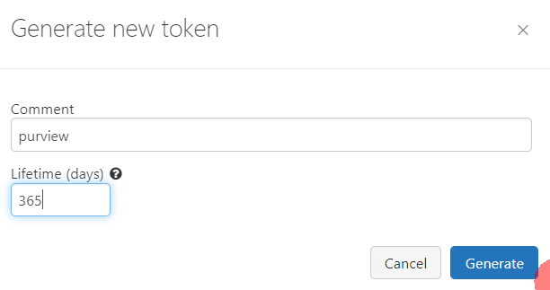
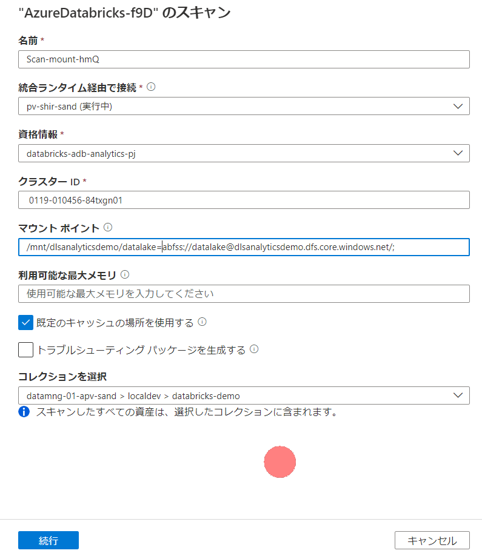

## はじめに

Purviewから簡単にDatabricksのスキャンができるPreviewが来ていたので試してみました。

[Microsoft Purview で Azure Databricks に接続して管理する (プレビュー)](https://learn.microsoft.com/ja-jp/azure/purview/register-scan-azure-databricks)

### 注意事項

2023/01/19 時点の確認結果です。

また、一部リソース名などからエンドポイントを推定できる箇所があるかもしれませんが、デモ用の一次的な環境で作成してます。

## 取得対象

現時点では、スコープスキャンができないのですべて取得される想定ですが、
hive_metastoreの対象は以下からdemo_devを確認したいと思います。

salesはマネージドテーブルです。

movies はアンマネージドテーブルとしてtype=EXTERNALとなっています。

## 準備

### Purview用のセルフホステッド統合ランタイムの構成

AzureVMを利用しています。ちなみにDSVMイメージを使うと色々楽でした。

1.JDK 11のインストール

数秒で完了

2.Visual Studio 2012 Update 4 の Visual C++ 再頒布可能パッケージのインストール

数秒で完了

3.セルフホステッド統合ランタイムのインストールと構成

[セルフホステッド統合ランタイムを作成して共有する](https://learn.microsoft.com/ja-jp/azure/purview/manage-integration-runtimes)に基づいてインストールから構成を進めました。

Purview上でランタイムを作成

キーを取得

VM側でキーを設定して接続

Purview側から見てセルフホステッド統合ランタイムがオンラインになっています

### 個人用アクセストークンとクラスター作成

DatabricksへのPurviewからの認証には個人用アクセストークンを利用するので、これを発行します。

1. トークン発行

発行したトークンをKey Vaultに登録しておきます。

2. クラスター作成

手順など割愛しますが、低スペックのシングルノードクラスターを作成しました。

### Purview用のKey Vaultの構成

トークンの保管されたKey Vaultに対してPurviewを接続しておく必要があります。

keyvault接続

## 手順 

では実際にDatabricksをスキャンしてみます。手順は冒頭のリンクに従っています。

### Databricks ソースの登録

まずは、ソース登録です。

1.ソース登録画面からDatabricksを選択します。

2.対象のワークスペースを選択すれば完了です。

### スキャンの実行 マウントポイントなし

最初の実行では、省略可能なマウントポイントはなしで実施してみます。

スキャン作成画面から資格情報を作成して、KeyVaultに保管した個人用アクセストークンを使えるようにしておきます。

クラスターIDをクラスター情報から取得します。

スキャン設定はこのようになりました。この設定で実行してみます。

### 結果確認 マウントポイントなし

マウントポイントなしでの実行確認です。およそ2分超で完了しました

databricksワークスペースと関連するhive server , hive DBが登録されています。

Databricksのアセットはこのようになります

関連はなし

hive serverに遷移します。

Hive DBが関連として登場し、スキーマが表示されています。

取得対象としたdemo_devのhive dbに移動します

外部テーブルであるmovies

マネージドテーブルであるsales

現時点ではアンマネージドテーブルとは特に差異がありませんね。

### スキャンの実行 マウントポイントあり

次にマウントポイントを指定してみます。

マウント情報は以下のように確認し、moviesテーブルが保管されている/mnt/dlsanalyticsdemo/datalakeを使ってみます。

スキャン設定は以下の通り

### 結果確認 マウントポイントあり

アンマネージドテーブルであるmoviesには系列が追加されました。マネージドテーブルには特に変更なしです。

### スキャンの実行 Unity Catalog有効の場合

対象のワークスペースをunity catalogを適用してdata explorerでunity catalogのテーブルも表示されるようにしてみます。

この状態でスキャンを実行するとどうなるか。

### 結果確認 Unity Catalog有効の場合

取り込みアセット数が変わっていないので、やはりUnity Catalog配下のデータは取得対象外ですね

実際に、Hiveテーブルなどのカタログ追加は発生していませんでした。

たとえばこのテーブルは

カタログで検索しても表示されません。

## 所見

アンマネージドテーブルのストレージとの関係がとれるのは結構うれしいですね。これであればDataFactoryとの連携が取れるのではと思います（リソースセットではなくパスの種類なので多少限定されると思いますが）

一方で、マウントする形式はUnity Catalog配下では推奨されなくなるものという認識なので、Unity Catalogとの連携が早く来るといいですね

## その他気になった点の確認結果

### クラスタの自動起動

クラスタ休止中にスキャンが走るとどうなるか確認しました。

きちんと自動起動しています。この分スキャン時間は延びるかとは思いますが、セルフホステッド統合ランタイムなのでコストも大丈夫そう

### マネージドテーブルのリネージ

だめもとでマウントポイントにDatabricksマネージドストレージ上のrootを入れて動かしてみましたが、リネージは取れませんでした。
これについては別に良いかなという感じ（マネージドストレージへのリネージとってもしょうがないので）

