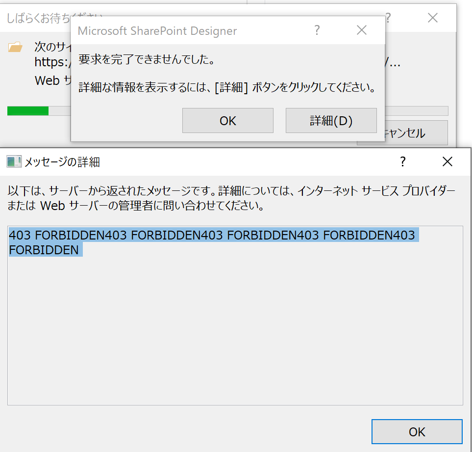
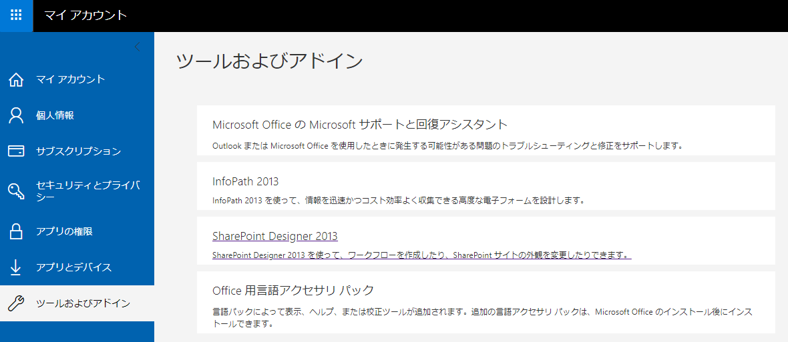
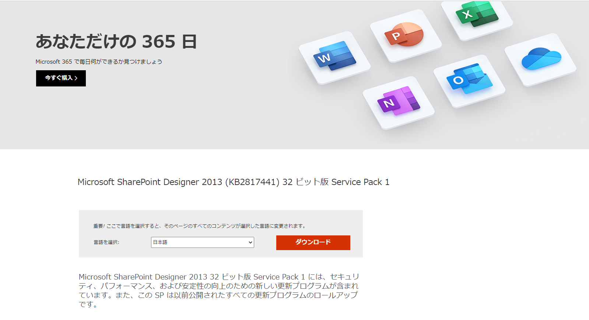
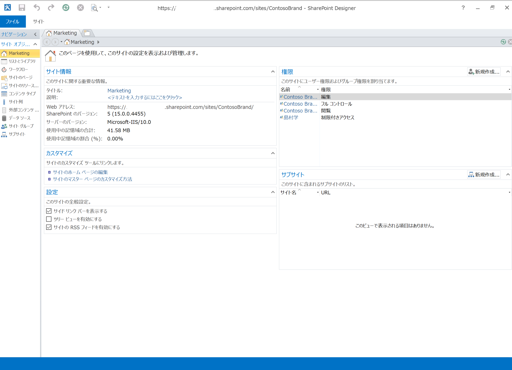

## 概要

SharePoint Designerを、下記のエラーが表示がされたのですが、後述のリンク記事を参考に"Microsoft SharePoint Designer 2013 (KB2817441) 32 ビット版 Service Pack 1"を適応したところ解決したことを共有します。

>403 FORBIDDEN403 FORBIDDEN403 FORBIDDEN403 FORBIDDEN403 FORBIDDEN

Microsoft 365の"ツールおよびアドイン"からインストールした場合、同様のエラーになってしまうため注意が必要です。

Microsoft 365の"ツールおよびアドイン"からインストールした場合、同様のエラーになってしまうため注意が必要です。

## 手順

1.  [リンク](https://www.microsoft.com/ja-jp/download/details.aspx?id=42015)から、"Microsoft SharePoint Designer 2013 (KB2817441) 32 ビット版 Service Pack 1"をダウンロードし、既存のSharePoint Designerを更新

2.  SharePointのサイトに接続したことを確認。

## 参考リンク

-   [SharePoint Designerの開く権限がありませんエラーについて](http://sptakesato.blog.fc2.com/blog-entry-15.html)